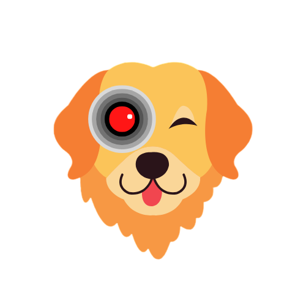

<div id="top"></div>

<!-- PROJECT SHIELDS -->

[![Contributors][contributors-shield]][contributors-url]
[![Forks][forks-shield]][forks-url]
[![Stargazers][stars-shield]][stars-url]
[![Issues][issues-shield]][issues-url]
[![MIT License][license-shield]][license-url]

<!-- PROJECT LOGO -->
<br />
<div align="center">

  <a href="https://github.com/kolbyrogers/ai-petcam">
    
  </a>

  <h3 align="center">AI Petcam</h3>

  <p align="center">
    An awesome full stack web app to keep track of your pets while you're away!
    <br />
    <br />
    <a href="https://ai-petcam.onrender.com" target="_blank">Hosted Site</a>
    ·
    <a href="https://github.com/kolbyrogers/ai-petcam/issues">Report Bug</a>
    ·
    <a href="https://github.com/kolbyrogers/ai-petcam/issues">Request Feature</a>
  </p>
</div>

<!-- ABOUT THE PROJECT -->

## About The Project

Built for my senior project at UTU, this app allows users to turn an old smartphone (or other device with a camera) into an AI powered petcam. Using the COCO-SSD model, the app will detect when a pet is in the frame, and interacting with other household objects. It will then create an event, and store it in a log so the user can see what their pets have been up to. The user can also configure it to monitor a specific object, and the app will send an SMS alert, and/or play a noise for the pet when the object is interacted with.

Project features:

- A responsive client interface
- RESTful API
- Client-side and server-side data validation
- Data persistence
- User authentication and authorization

### Built With

- Vue.js (Nuxt)
- Express
- TensorFlow.js (COCO-SSD)
- Firebase
  - Authentication (google), Image Storage
- MongoDB

### Special Thanks

- Twilio
  - I used Twilio's API to send SMS alerts to users
- Render
  - I used render to host the app

<!-- SETUP -->

## Setup

### Clone Repo

```sh
git clone git@github.com:kolbyrogers/ai-petcam.git
```

### Install Dependencies

```sh
npm install
```

### Serve at localhost:3000

```sh
npm run dev
```

<!-- CONTRIBUTING -->

## Contributing

Contributions are what make the open source community such an amazing place to learn, inspire, and create. Any contributions you make are **greatly appreciated**.

If you have a suggestion that would make this better, please fork the repo and create a pull request. You can also simply open an issue with the tag "enhancement".
Don't forget to give the project a star! Thanks again!

1. Fork the Project
2. Create your Feature Branch (`git checkout -b feature/AmazingFeature`)
3. Commit your Changes (`git commit -m 'Add some AmazingFeature'`)
4. Push to the Branch (`git push origin feature/AmazingFeature`)
5. Open a Pull Request

<p align="right">(<a href="#top">back to top</a>)</p>

<!-- MARKDOWN LINKS & IMAGES -->
<!-- https://www.markdownguide.org/basic-syntax/#reference-style-links -->

[contributors-shield]: https://img.shields.io/github/contributors/kolbyrogers/ai-petcam.svg?style=for-the-badge
[contributors-url]: https://github.com/kolbyrogers/ai-petcam/graphs/contributors
[forks-shield]: https://img.shields.io/github/forks/kolbyrogers/ai-petcam.svg?style=for-the-badge
[forks-url]: https://github.com/kolbyrogers/ai-petcam/network/members
[stars-shield]: https://img.shields.io/github/stars/kolbyrogers/ai-petcam.svg?style=for-the-badge
[stars-url]: https://github.com/kolbyrogers/ai-petcam/stargazers
[issues-shield]: https://img.shields.io/github/issues/kolbyrogers/ai-petcam.svg?style=for-the-badge
[issues-url]: https://github.com/kolbyrogers/ai-petcam/issues
[license-shield]: https://img.shields.io/github/license/kolbyrogers/ai-petcam.svg?style=for-the-badge
[license-url]: https://github.com/kolbyrogers/ai-petcam/LICENSE.txt
